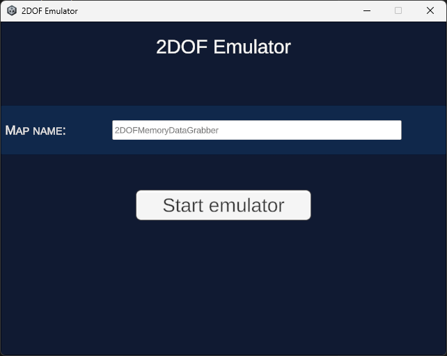

# 2DOF Emulator

[Rus](README.md) | [ENG](README_ENG.md)

## Описание

Этот проект может эмулировать устройство 2DOF Emulator на основе получаеммых данных из 2DOF-Plugin.

## Лицензия

Этот проект лицензирован под лицензией MIT - подробности см. в файле LICENSE.

## Контакты

2DOF Emulator - это проект студента RTU TVP Шутова Кирилла. Если у вас есть вопросы, пожалуйста, свяжитесь со мной по электронной почте: i@shutovks.ru.

## Скриншоты

