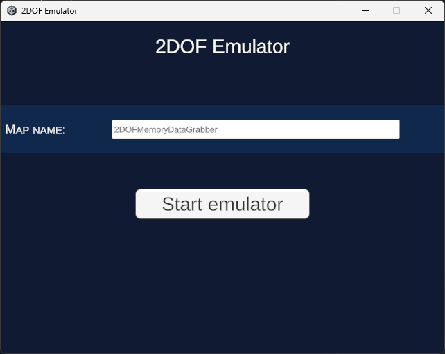
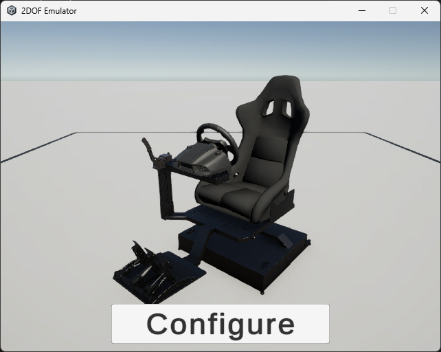

# 2DOF Emulator

[RU](README.md) | [EN](README_ENG.md)

## Description

This project can emulate a 2DOF device based on data received from the 2DOF Plugin.

## License

This project is licensed under the MIT license - details can be found in the LICENSE file.

## Contacts

2DOF Emulator is a project by RTU TVP student Shutov Kirill. If you have any questions, please contact me at: i@shutovks.ru.

## Screenshots

